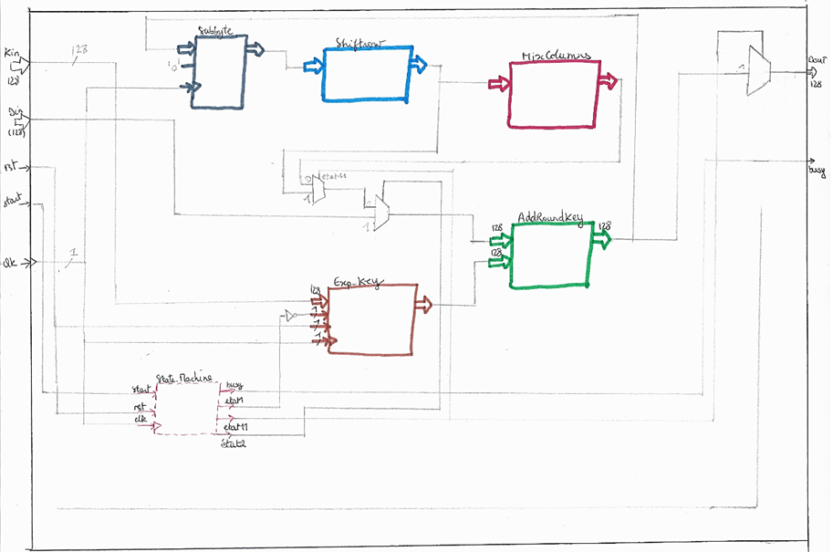

## AES_128_bits_Encryption_Decryption

The goal of this project was to implement 128-bits AES encryption algorithm in VHDL. I also did the decryption algorithm and therefore put the two together. 
I did the synthesis with Quartus and the simulation with ModelSim. 
So the architecture of the final System is :

# AES encryption

Architecture generated with Quartus : 

Ressources used : 

# AES decryption

Architecture generated with Quartus : 

Ressources used : 

